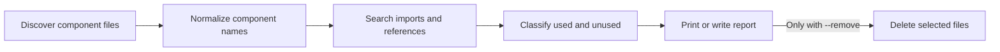

# component-prune

A TypeScript CLI for finding and optionally removing unused UI components across modern frontend projects.

[npm package](https://www.npmjs.com/package/component-prune)

## Why it exists

Component libraries grow quickly. Experiments, generated UI, redesigns, and renamed imports can leave component files behind long after their last use. `component-prune` provides a fast inventory before a developer decides what should be removed.

The default operation is read-only. Deletion happens only when `--remove` is supplied.

## Supported projects

The scanner recognizes common JavaScript and TypeScript component formats used by React, Vue, Svelte, Solid, Astro, and MDX projects. It understands several naming conventions and can inspect common barrel-file usage.

- `.tsx`, `.jsx`, `.ts`, and `.js`
- `.vue` and `.svelte`
- `.solid.js`
- `.astro` and `.mdx`
- PascalCase, camelCase, kebab-case, and snake_case filenames
- Custom ignore patterns through `.componentignore`
- Special handling for common `components/ui` layouts

## Install

```bash
npm install --global component-prune
```

Or run it without a global installation:

```bash
npx component-prune
```

## Usage

```bash
component-prune [path] [components...] [options]
```

| Option | Purpose |
| --- | --- |
| `--verbose` | Print both used and unused components |
| `--json <path>` | Write the result to a JSON report |
| `--remove` | Delete files reported as unused |
| `-V, --version` | Print the installed version |

Scan a project without modifying it:

```bash
component-prune src --verbose
```

Generate a reviewable report:

```bash
component-prune src --json component-report.json
```

Remove only explicitly named components:

```bash
component-prune src calendar.tsx sheet.tsx --remove
```

## How analysis works



The package exposes its scanner, usage analyzer, remover, ignore-rule loader, and JSON reporter for programmatic use.

## Safety and limitations

Static analysis cannot prove every runtime reference. Dynamic imports, generated files, framework plugins, string-based resolution, aliases that are not represented in source, and external consumers can produce false positives.

Before using `--remove`:

1. Commit or stash the working tree.
2. Run without `--remove` and inspect the report.
3. Run the application’s tests and production build.
4. Prefer naming the exact components you intend to remove.

Do not run destructive mode against an uncommitted codebase.

## Development

```bash
npm install
npm run build
node dist/bin/index.js --help
```

## Planned validation work

Before this repository becomes a primary portfolio pin, add fixture-based tests for every supported framework, path-alias cases, barrel exports, dynamic-import limitations, and destructive-mode safeguards. Add CI for build, tests, and package smoke installation.

## License

MIT © Chimezie Innocent
